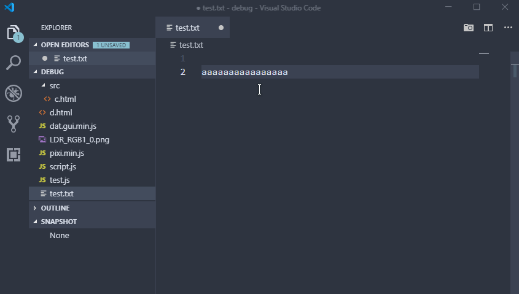

快照：对指定数据集合的一个完全可用拷贝，该拷贝包括相应数据在某个时间点的映像，它的作用主要是能够进行在线数据备份与恢复。

我写代码时经常遇到这样的问题（当然有可能是因为我的编程习惯才会有这样困扰）：比如正在写一个功能，忽然脑中冒出一种新的实现方法，于是开始编码去验证可行性，结果发现不可行或想回去看看原来的代码，那么只能撤销修改，一次次的按<kbd>Ctrl</kbd>+<kbd>Z</kbd>，不仅麻烦，而且经常回退不到原来正确代码的位置。

PhotoShop的每一次对画布的操作都会生成一个历史记录，撤销操作除了使用撤销快捷键，还可以从“历史记录”面板直接选择某一步操作，瞬间回退，一步到位。在历史记录面板上还有一个创建快照的功能，它能保存某一次操作后的状态。这二者有什么区别？我的看法是，历史记录是软件自动记录的，而快照是人有意识的去记录。前者记录每一个状态，而后者记录的是人认为重要的状态，当然也不是所有重要的状态都记得给它创建快照了。

编写代码和用PS画图不同，软件很难记录每个状态，除了通过撤销回退字符的变化。当然，快照对于我们来说可能是更有用的，也容易实现。比如利用**git**的提交是一种方法。

我想做的是能集成到写代码的软件中且更可视化。当我的主力编辑器是**Atom**时，它正好提供了自定义扩展，于是我写了个**Atom package**：[atom-snapshot](https://github.com/vczhan/atom-snapshot)，后来我“叛变”到了**VS Code**，但VS Code对视图的定制不如Atom，所以我的VS Code一直缺少快照的功能，直到我又一次回退把代码搞砸了，决心要给我的VS Code加上快照功能。最终，通过查阅官方文档和参考一些类似的扩展源码，基本做出来了，虽然还有些小瑕疵。下面是写这个扩展的思维导图和演示

